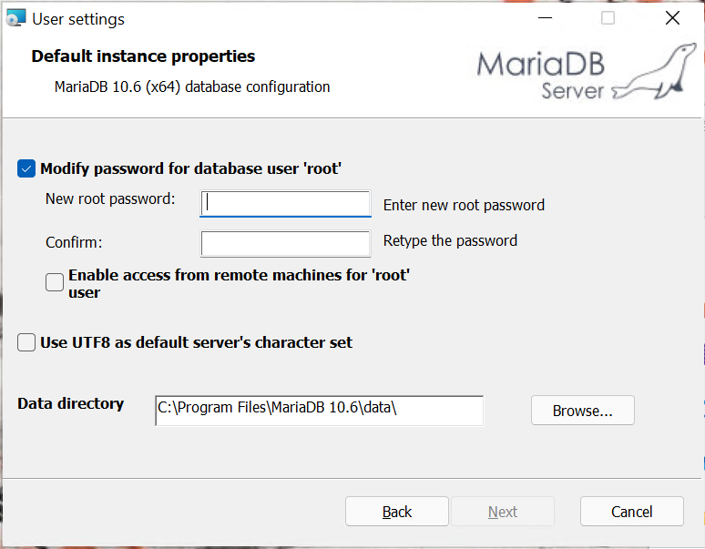

# Installer MariaDB

## Pourquoi ?

- MariaDB est un **serveur de bases de données**, ou SGBD. Il faut installer ce logiciel pour qu'il puisse recevoir vos requêtes SQL et les exécuter sur la base exemple PachadataFormation.
- MariaDB est un logiciel libre et gratuit, vous pouvez l'installer comme bon vous semble.
- Vous pouvez installer MariaDB sur votre propre machine ou sur un ordinateur sur votre réseau, en Windows, Linux ou Mac OS.

## Comment

1. Récupérez le fichier d'installation de MariaDB, [à cette adresse](https://mariadb.org/download). Choisissez votre système d'exploitation, et prenez en général l'architecture 64. Choisissez un fichier d'installation facile (`MSI` pour Windows).
2. Lancez l'installation. Sur Windows, suivez les étapes suivantes :
   - Acceptez les termes de la licence en cliquant sur *I accept the terms...*
   - Choisissez de tout installer (ne changez rien), appuyez sur `Next`.
   - Choisissez un mot de passe pour le compte administrateur `root`, comme indiqué dans la figure suivante. Vous pouvez mettre un mot de passe simple à mémoriser, comme `root`, tant que vous n'utilisez pas ce serveur MariaDB pour des données importantes.

3. Cliquez sur **Enable access from remote machines for 'root' user** si vous souhaitez accéder à ce serveur MariaDB depuis une autre machine (par exemple si vous installez DBeaver sur un autre ordinateur). En cas de doute, cochez la case.
4. Vous pouvez ensuite cliquer sur `Next` et `Install` pour la suite.