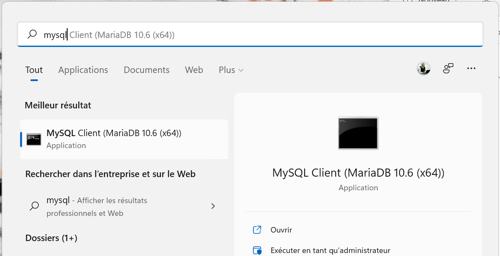

# Créer et restaurer la base de données PachadataFormation sur MariaDB

## Résumé

- Vous trouvez dans ce répertoire un fichier nommé `pachadataformation.sql`.
- Il contient le code qui permet de recréer la base PachadataFormation sur MySQL ou MariaDB.
- Ce fichier a été créé par l'utilitaire `mysqldump` dans MariaDB.
- Nous allons utiliser les outils en ligne de commande pour recréer cette base.

## Restaurer la base

1. Chercher votre utilitaire `mysql.exe` sur votre système. Par exemple, sur Windows 10 / Windows 11 :



2. Cet outil va tenter de se connecter à MariaDB sur la machine locale, et va vous demander le mot de passe de l'utilisateur `root` que vous avez créé à l'installation. Indiquez-le sur la ligne qui vous demande "`Enter password: `"

3. Si cela fonctionne, vous allez vous retrouver sur une ligne qui indique "`MariaDB [(none)]>`", vous pourrez taper les commandes suivantes sur ce "prompt" :

```sql
CREATE DATABASE pachadataformation;
```
4. Ce qui devrait vous retourner : "`Query OK, 1 row affected`"
5. Entrez la commande `exit` **une fois** pour quitter ce prompt, et revenir sur le prompt système.
6. Saisissez ensuite la commande suivante pour restaurer le contenu du fichier `pachadataformation.sql` dans MariaDB :

```shell
./mysql -u root -p pachadataformation < c:\temp\pachadataformation.sql
```
(cette commande suppose que vous avez posé le fichier `pachadataformation.sql` dans `c:\temp\` sur Windows. Changez ce chemin pour retrouver votre fichier `pachadataformation.sql`).

7. La commande va vous redemander le mot de passe root, indiquez-le et appuyez sur entrée.
8. Attendez quelques minutes que cela se termine. Vous devriez avoir votre base PachadataFormation.
